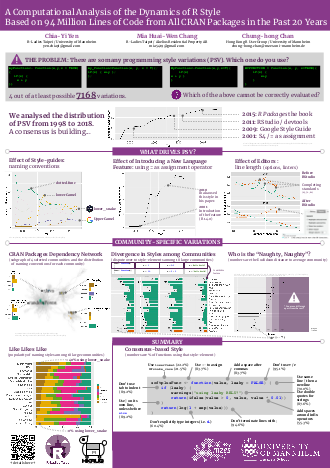

# rstyle

[](https://zenodo.org/badge/latestdoi/168371451)



## Citation

Please cite this as: Yen, C.Y., Chang, M.H.W., Chan, C.H. (2019) *A Computational Analysis of the Dynamics of R Style Based on 94 Million Lines of Code from All CRAN Packages in the Past 20 Years.* [Paper presented at the useR! 2019 conference, Toulouse, France.](docs/user2019_poster.pdf) doi:10.31235/osf.io/ts2wq

Preprint of this paper is available [here](https://osf.io/preprints/socarxiv/ts2wq/).

## Assumptions

1. Clone the entire CRAN into `./cran` subdirectory. [^1]

```sh
rsync -rtlzv --delete cran.r-project.org::CRAN ./cran
```

It takes 220G of disk space.

2. Create the code.db using the Makefile (Don't do that if you already have `code.db`)

## Files and dependencies

### Key RDS files:

In `data` directory

1. target_meta.RDS - packages, one (randomly-selected) submission per year.

2. pkgs_functions_with_syntax_feature.RDS - package information with syntatic features.

### R files:

#### 0prep - collecting data and sampling

1. **0prep01_extract_metadata.R** (requires: Cloned CRAN mirror): extract meta data from tarballs. Generate *target_meta.RDS* and *final_meta.RDS* in `data` directory.

2. **cat code.sql | sqlite3 code.db** : generate the schema of the SQLITE database - code.db. Generate *code.db*.

3. **0prep02_dump.R** (requires: Cloned CRAN mirror, target_meta.RDS): dump the source code, NAMESPACEs and DESCRIPTIONs into code.db. Generate *code.db* with data. It is very large (> 20G).

4. **0prep03_extract_desc.R** (requires: Cloned CRAN mirror, target_meta.RDS): add the text description also into target_meta.RDS as a column *desc*. Generate *target_meta.RDS* (overwrite) in `data` directory.

#### 1functionnames - Analysis of function names

1. **1functionnames01_extract_function_name.R** (requires: code.db): extract names of all exported function from each package. Generate multiple *fx_data_yr...RDS* files in `data` directory.

2. **1functionnames02_function_name_analysis.R** (requires: *fx_data_yr...RDS* files): analyse the style in function names by year. Generate *fx_style_by_year.RDS* in `data` directory.

3. **1functionnames03_function_name_vis.R** (requires: *fx_style_by_year.RDS*): visualize the time trends of styles in function names. Generate images(END)

#### 2syntax - Analysis of style elements

1. **2syntax01_extract_features.R** (requires: target_meta.RDS, code.db): extract syntactic features. This procedure is both CPU and I/O intensive. On a normal i5 computer, it would take a month to run. Generate *syntax_feature_yr...RDS* files in `data` directory.

2. **2syntax02_gen_pkgs_functions_with_syntax_feature.R** (requires: *syntax_feature_yr...RDS* files): combine all .RDS files into one. Generate pkgs_functions_with_syntax_feature.RDS.

3. **2syntax03_vis.R** (requires: pkgs_functions_with_syntax_feature.RDS): Visualize the time trends of syntactic features. Generate images. (END)

#### 3linelength - Analysis of line length

1. **3linelength01_extraction.R** (requires: code.db):  generate **comment_dist.RDS** in `data` directory.

2. **3linelength02_animation.R** (requires: comment_dist.RDS): generate shiny app.

#### 4communities - Community-based analysis

1. **4communities01_extract_cran_dependency.R** (requires: code.db): extract dependencies of packages from CRAN. Generate **cran_dependency.RDS** (END)

2. **4communities02_build_cran_graph.R** (requires: cran_dependency.RDS): build CRAN dependency graph based on two fields, say "Import" and "Suggests." Generate **cran_graph.RDS**(END)

3. **4communities03_detect_cran_community_by_walktrap.R** (requires: cran_graph.RDS): detect CRAN communities by using walktrap algorithm. Generate **comm_walktrap.RDS** and **comm_size.RDS**. In addition, it examines the robustness of identified communities with respect to the choice of random seeds(END)

4. **4communities04_community_based_features_correction.R** (requires: pkgs_functions_with_syntax_feature.RDS, comm_walktrap.RDS, comm_size.RDS, comm_name.csv): assign community labels to each package, such that package-level summary of syntax features and naming features can be usage for analyzing the style variations among communites. Only apply to the largest 20 communites. Generate **comm_largest_feature.RDS** (END)

5. **4communities05_vis_community_poster_images.R** (requires: comm_largest_feature.RDS, cran_graph.RDS, comm_walktrap.RDS, comm_size.RDS, naming_convention.csv): visualize community-related analysis (END)

#### 5conversion - Convert key RDS files to csv for preservation

1. **5conversion01_make_csv.R** (requires: target_meta.RDS, pkgs_functions_with_syntax_feature.RDS): Convert RDS files to csv (END)

# Related projects

* [baaugwo](https://github.com/chainsawriot/baaugwo) - this project depends on this experimental package to extract meta data and dump code from R packages.

# How to use the Docker to build and launch the docker instance?

- Build the docker image using the provided [Dockerfile](https://github.com/chainsawriot/rstyle/blob/master/docker/Dockerfile)

    - it is way faster if one builds the docker image inside the directory **docker** because less data are copied. 
```sh
cd docker/ ;
docker build -t rstudio/rstyle -f Dockerfile . ;
cd ../ ;
```
- By default, docker launches RStudio Server and mounts folders using **root** user. It makes user **rstudio** (the default user of RStudio server) with no write access. 
- One of the solutions of this problem is to make docker launching RStudio Server by using current the UID

```sh
docker run -v $(pwd):/home/$USER/rstyle -e USER=$USER -e PASSWORD=xxxx -e USERID=$UID -p 8787:8787 rstudio/rstyle
```
- or you can launch a development dashboard by executing the following command:
```sh
bash dev-tmux.sh
```

If one is developing under Window Subsystem for Linux (WSL), you may encounter a problem that docker cannot see the folder you mounted in the container. In that case, please try to soft link `/mnt/c/` to the root directory as illustrated in this [blog post](https://medium.com/@lixis630/extra-setup-on-wsl-for-ros-7c539463370a).

And then clone this repository anywhere inside /c/Users/{YOUR_USERNAME}. And then specify the `PATH_RSTYLE` environment variable as shown below, such that you can launch the dashboard successfully.

```sh
PATH_RSTYLE=/c/Users/{YOUR_USERNAME}/{PATH_TO_RSTYLE}/rstyle bash dev-tmux.sh
```
 
# Label the names of identified communities by walktrap algorithm
We manually assigned a name to the largest identified communities by their 3 most important package members. We priorized importance of packages within a community by the algorithm PageRank. 

| comm_id|comm_name              |top                                 |
|-------:|:----------------------|:-----------------------------------|
|       6|base                   |methods, stats, MASS                |
|       4|Rstudio                |testthat, knitr, rmarkdown          |
|      28|Rcpp                   |Rcpp, tinytest, pinp                |
|       3|Statistical Analysis   |survival, Formula, sandwich         |
|       9|Machine Learning       |nnet, rpart, randomForest           |
|      16|Geography 1            |sp, rgdal, maptools                 |
|      15|GNU                    |gsl, expint, mnormt                 |
|      25|Bioconductor: Graph    |graph, Rgraphviz, bnlearn           |
|      49|Text Analysis          |tm, SnowballC, NLP                  |
|      42|GUI                    |tcltk, tkrplot, tcltk2              |
|      13|Infrastructure 1       |rsp, listenv, globals               |
|      17|Numerical Optimization |polynom, magic, numbers             |
|      40|Bioconductor: Genomics |Biostrings, IRanges, S4Vectors      |
|      77|RUnit                  |RUnit, ADGofTest, fAsianOptions     |
|      24|Survival Analysis      |kinship2, CompQuadForm, coxme       |
|       2|Sparse Matrix          |slam, ROI, registry                 |
|      44|Infrastructure 2       |RGtk2, gWidgetstcltk, gWidgetsRGtk2 |
|      75|Bioinformatics         |limma, affy, marray                 |
|      37|IO                     |RJSONIO, Rook, base64               |
|      45|rJava                  |rJava, xlsxjars, openNLP            |

----
[^1]: [CRAN mirror HOWTO/FAQ](https://cran.r-project.org/mirror-howto.html)

