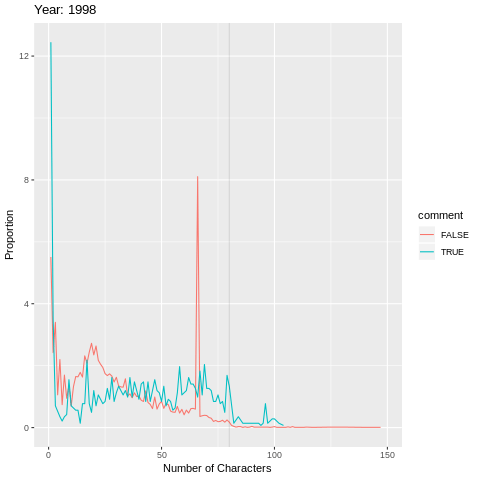
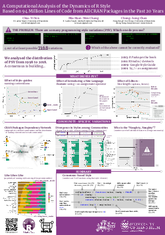

# rstyle

 

## Citation

Please cite this as: Yen, C.Y., Chang, M.H.W., Chan, C.H. (2019) *A Computational Analysis of the Dynamics of R Style Based on 94 Million Lines of Code from All CRAN Packages in the Past 20 Years.* [Paper presented at the useR! 2019 conference, Toulouse, France.](user2019_poster.pdf) doi:10.31235/osf.io/ts2wq

Preprint of this paper is available [here](https://osf.io/preprints/socarxiv/ts2wq/).

## Assumptions

1. Clone the entire CRAN into `./cran` subdirectory. [^1]

```sh
rsync -rtlzv --delete cran.r-project.org::CRAN ./cran
```

It takes 220G of disk space.

2. Create the code.db using the Makefile (Don't do that if you already have `code.db`)

## Files and dependencies

### Key RDS files:

1. target_meta.RDS - packages, one (randomly-selected) submission per year.

2. pkgs_functions_with_syntax_feature.R - package information with syntatic features.

### R files:

#### prep - collecting data and sampling

1. **extract_metadata.R** (requires: Cloned CRAN mirror): extract meta data from tarballs. Generates *target_meta.RDS* and *final_meta.RDS*.

2. **cat code.sql | sqlite3 code.db** : generate the schema of the SQLITE database - code.db. Generates *code.db* without data.

3. **dump.R** (requires: Cloned CRAN mirror, target_meta.RDS): dump the source code, NAMESPACEs and DESCRIPTIONs into code.db. Generates *code.db* with data. It is very large (> 20G).

4. **extract_desc.R** (requires: Cloned CRAN mirror, target_meta.RDS): add the text description also into target_meta.RDS as a column *desc*. Generates *target_meta.RDS* (overwrite).

#### fun - Analysis of function names

1. **fun01_extract_function_name.R** (requires: code.db): extract names of all exported function from each package. Generates multiple *fx_data_yr...RDS* files in `data` directory.

2. **fun02_function_name_analysis.R** (requires: *fx_data_yr...RDS* files): analyse the style in function names by year. Generates *fx_style_by_year.RDS* in `data` directory.

3. **fun03_function_name_vis.R** (requires: *fx_style_by_year.RDS*): visualize the time trends of styles in function names. Generates images(END)

#### syntax - Analysis of style elements

1. **syntax01_extract_features.R** (requires: target_meta.RDS, code.db): extract syntactic features. It takes a long time. Generates *syntax_feature_yr...RDS* files in `data` directory.

2. **syntax02_gen_pkgs_functions_with_syntax_feature.R** (requires: *syntax_feature_yr...RDS* files): combine all .RDS files into one. Generates pkgs_functions_with_syntax_feature.RDS.

2. **syntax03_vis.R** (requires: pkgs_functions_with_syntax_feature.RDS): Visualize the time trends of syntactic features. Generates images. (END)

#### line

10. **analyse_line_length.R** (requires: code.db): visualize the change in line length as an animation. Generates **entropy_linelength.RDS**.

11. **analyse_master_entropy.R** (requires: entropy_fx_name.RDS, entropy_linelength.RDS): visualize the information entropy values of line length and function name's styles. Generates images. (END)

#### comm

12. **extract_cran_dependency.R** (requires: code.db): extract dependencies of packages. Generate **cran_dependency.RDS** (END)

13. **build_cran_graph.R** (requires: cran_dependency.RDS): build CRAN dependency graph based on two fields, say "Import" and "Suggests." Generate **cran_graph.RDS** (END)

14. **detect_cran_community_by_walktrap.R** (requires: cran_graph.RDS): detect CRAN communities by using walktrap algorithm. Generate **cran_community.RDS** (END)

# Related projects

* [baaugwo](https://github.com/chainsawriot/baaugwo) - this project depends on this experimental package to extract meta data and dump code from R packages.


# How to lunch docker in remote server?
- Build docker file
    - it is way faster if we build the docker image inside the director **docker** since it copies least data in this way. 
```sh
cd docker/ ;
docker build -t rstudio/rstyle -f Dockerfile . ;
cd ../ ;
```
- By default, docker launches rstudio server and mounts folders by using root user, which makes user **rstudio** not able to write files due to lack of previledge. 
- One of the solution of this problem is to ask docker to launch rstudio server by using current UID

```sh
docker run -v $(pwd):/home/$USER/rstyle -e USER=$USER -e PASSWORD=xxxx -e USERID=$UID -p 8787:8787 rstudio/rstyle
```
- or you can launch a development dashboard by executing the following command:
```sh
bash dev-tmux.sh
```
if you are developing under Window Subsystem Linus (WSL), you may encounter a problem that docker can not see the folder you mounted into the container. Then try to soft link /mnt/c/ to the root directory as illustrated in the blog article below:
https://medium.com/@lixis630/extra-setup-on-wsl-for-ros-7c539463370a
And git clone this repository anywhere under the /c/Users/{YOUR_USERNAME}. And then specify the PATH_RSTYLE as environment variable as shown below, such that you can launch the dashboard successfully.
```sh
PATH_RSTYLE=/c/Users/{YOUR_USERNAME}/{PATH_TO_RSTYLE}/rstyle bash dev-tmux.sh
```
 

# Notes regarding the result from Walktrap clustering
- **cran_community_20190518.RDS** is the result generated at 2019-M5-18, and the clustered communities makes much sense while we cannot replicate because we forgot to set a random seed.

|community id   | field   | 
|---|---|
| 15  | Rstudio-related packages  |
| 9  | base   |
| 4  | image plotting   |
| 60  | RCpp   |
| 14  | GPS and GEO   |
| 35  | ML   |
| 1  | public health and Statistics   |
| 36  | text analysis    |
| 25  | social network analysis   |
| 39  | mix of graphics and anomaly detection   |
| 23  | graph and its visualization   |
| 19  | genetics   |
| 31  | finance   |
| 8  | insurance and actuary   |
| 64  | numerical optimization    |
| 73  | sparse matrix   |
| 18  | Java   |
| 20  | time, date, and money   |
| 120  | neuronal science   |

----
[^1]: [CRAN mirror HOWTO/FAQ](https://cran.r-project.org/mirror-howto.html)

