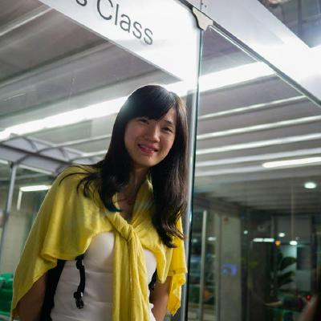

class: hide-logo, center, bottom, hide-footer

```{r xaringanExtra, echo = FALSE}
xaringanExtra::use_tile_view()
xaringanExtra::use_animate_all(params$animation)
xaringanExtra::use_logo(image_url = "img/mzes_logo.png", width = 280)
mzesalike::use_footer(params)
```


<table>
<tr>
<td><br>

.large[
**Chai-yi Yen**<br>
]
.small[
`r fontawesome::fa("github")` exilespacer

Universität Mannheim, R-Ladies Taipei
]

</td>
<td><br>

.large[
**Mia H.W. Chang**<br>
]

.small[
`r fontawesome::fa("github")` pymia

Akelius Residential Property AB, R-Ladies Taipei
]
</td>
<td><br>

.large[
**Chung-hong Chan**<br>
]

.small[
`r fontawesome::fa("github")` chainsawriot

Universität Mannheim, Hong Kong R User Group
]
</td>
</tr></table>

---
background-image: url(https://media1.tenor.com/images/28ee6748d1e75ed138a58dfda27a0469/tenor.gif?itemid=4855087)
background-position: center
background-size: cover
class: hide-logo, center, bottom, hide-footer


.imagelab[
We analyzed 108 million lines of code from CRAN and studied the evolution of how R programmers write R.
]

---

# For example: naming convention

```{r, echo = FALSE, message = FALSE, out.width = "60%", fig.align = "center"}
require(magick)
x <- image_read_pdf(here::here("rjournal_submission", "fig2.pdf"), density = 150) %>% image_convert(format = "png") %>% image_write(here::here("prez", "fig2.png"))
knitr::include_graphics(here::here("prez", "fig2.png"))
```

---
# And community-specific conventions

```{r, echo = FALSE, message = FALSE, out.width = "60%", fig.align = "center"}
x <- image_read_pdf(here::here("rjournal_submission", "fig4.pdf"), density = 150) %>% image_convert(format = "png") %>% image_write(here::here("prez", "fig4.png"))
knitr::include_graphics(here::here("prez", "fig4.png"))
```

---
# and more...

```{r, echo = FALSE, message = FALSE, out.width = "60%", fig.align = "center"}
x <- image_read_pdf(here::here("rjournal_submission", "fig1.pdf"), density = 150) %>% image_convert(format = "png") %>% image_write(here::here("prez", "fig1.png"))
knitr::include_graphics(here::here("prez", "fig1.png"))
```

---

# More info...


- `r fontawesome::fa("twitter")` @chainsawriot 
- `r fontawesome::fa("github")` [chainsawriot/rstyle](https://github.com/chainsawriot/rstyle)

